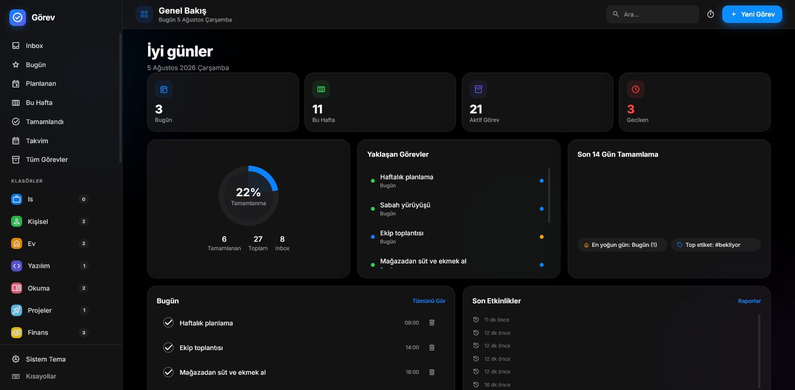
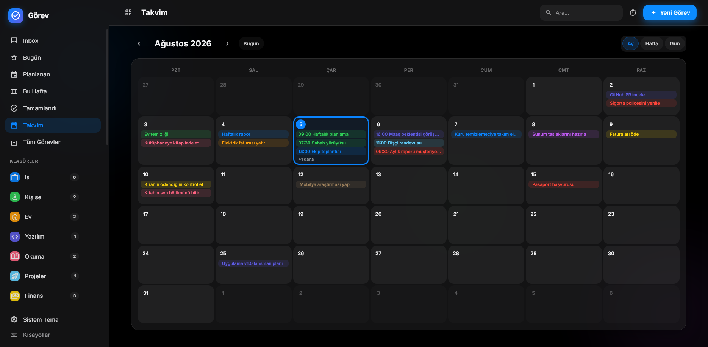
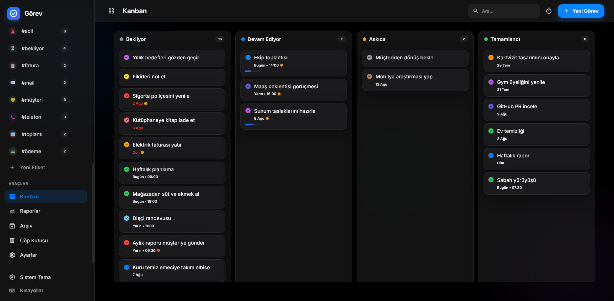
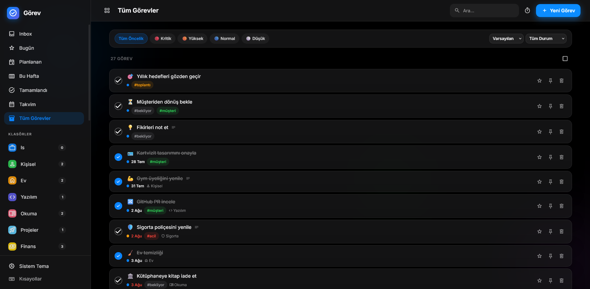
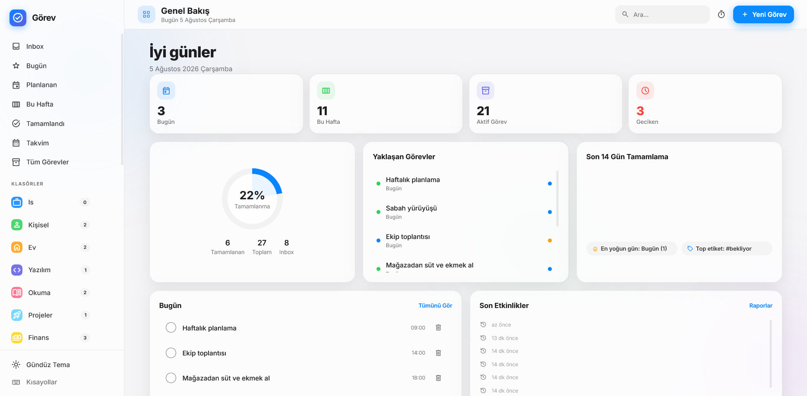

# Görev — Apple Tarzı Görev Yöneticisi

<p align="center">
  
</p>

<p align="center">
  Modern, hızlı, sade ve Apple Human Interface Guidelines yaklaşımında tamamen <b>lokal</b> çalışan bir görev yönetim sistemi.<br>
  Hesap yok, bulut yok — verileriniz cihazınızda <code>database.sqlite</code> içinde.
</p>

<p align="center">
  <a href="https://demolar.gt.tc/gorev"></a>
  <a href="#özellikler"></a>
  
  
  
  
</p>

---

## 🖥️ Ekran Görüntüleri

> Görseller `screenshots/` klasöründen yüklenir. (Örnek görselleri yerleştirmek için
> kendi ekran görüntülerinizi aynı adlarla bu klasöre koyun.)

<p align="center">
  
  
</p>

<p align="center">
  
  
</p>

<p align="center">


</p>

---

## 🚀 Canlı Demo

**▶ https://demolar.gt.tc/gorev**

Demo hesap veya kurulum gerektirmez; verileri tarayıcıda örnek görevlerle dolu olarak açılır.

---

## ✨ Özellikler

- **Görevler** — başlık, markdown notlar, başlangıç/bitiş tarihi, saat, hatırlatma, öncelik (Düşük/Normal/Yüksek/Kritik), durum (Bekliyor/Devam/Askıda/Tamamlandı/İptal), tahmini/gerçek süre, % ilerleme, renk, emoji, ikon, dosya eki, konum, favori, sabitleme
- **Tekrarlayan görevler** — günlük, hafta içi, haftalık, 2 haftada bir, aylık, 3/6 aylık, yıllık ve özel; tamamlanınca otomatik sonraki kayıt
- **Klasörler & Etiketler** — ikon/renk/açıklamalı klasörler, emoji destekli renkli sınırsız etiket; yeniden adlandırma ve silme
- **Alt görevler & Checklist** — sonsuz seviye, otomatik ilerleme hesabı
- **Takvim** — ay / hafta / gün; sürükle-bırak ile tarih değiştirme
- **Kanban** — 4 sütun, sürüklenebilir kartlar
- **Raporlar** — Chart.js ile tamamlama, haftalık/aylık üretkenlik, etiket/öncelik dağılımı
- **Hızlı ekle (Ctrl+N)** — Türkçe doğal dil: *"Yarın saat 15'te Ahmet'i ara"*
- **Canlı arama & filtreleme** — başlık, not, etiket, klasör, dosya adı; çoklu filtre ve sıralama
- **Toplu işlemler** — çoklu seçimle sil, arşivle, taşı, etiket ekle, durum/öncelik değiştir
- **Dashboard** — istatistik kartları, tamamlanma halkası, yaklaşan görevler, son 14 gün grafiği
- **Bildirimler** — tarayıcı Notification API + WebAudio ses
- **Yedekleme** — tek tıkla ZIP yedek, geri yükle, otomatik günlük yedek
- **İçe/Dışa aktarım** — JSON, CSV, Excel uyumlu CSV, Markdown
- **Pomodoro** sayacı, **klavye kısayolları**, arşiv, çöp kutusu, etkinlik günlüğü
- **Tema** — sistem / gündüz / koyu, vurgu rengi seçimi, cam (glassmorphism) efektleri

---

## 📸 Tema

| Gündüz | Koyu |
|---|---|
|  |  |

---

## 🛠️ Kurulum

### XAMPP (önerilen)

1. Bu klasörü `C:\xampp\htdocs\gorev2` içine kopyalayın (veya web köküne).
2. Apache & PHP çalışıyor olmalı (PHP 8.2+).
3. Tarayıcıda `http://localhost/gorev2/` adresini açın.
4. İlk açılışta `database.sqlite` ve tüm tablolar **otomatik** oluşturulur.

### PHP built-in sunucu

```bash
cd gorev2
php -S localhost:8000
# http://localhost:8000
```

> **Gereksinimler:** PHP 8.2+, `pdo_sqlite` eklentisi (XAMPP varsayılandır). Build/Node/Composer gerekmez.

---

## 🧱 Teknolojiler

| Katman | Teknoloji |
|---|---|
| Backend | PHP 8.2+, PDO, SQLite (WAL) |
| Frontend | HTML5, TailwindCSS, Alpine.js, Chart.js, Material Symbols, Inter, Flatpickr, SortableJS |
| Build | Yok — derlemesiz, tamamen lokal |

---

## 📁 Dosya Yapısı

```
/
├── index.php      → SPA kabuğu (tüm görünümler)
├── api.php        → JSON API (tüm işlemler)
├── config.php     → DB bağlantısı, şema, yardımcılar
├── demo.php       → demo veri üretici
├── database.sqlite
├── assets/
│   ├── css/app.css
│   ├── js/app.js
│   └── icons/icon.svg
├── screenshots/   → README görselleri
├── uploads/       → dosya ekleri
└── backup/        → yedekler
```

---

## ⌨️ Klavye Kısayolları

| Tuş | Eylem |
|---|---|
| `Ctrl+N` | Hızlı görev ekle |
| `Ctrl+F` | Arama |
| `Ctrl+S` | Görevi kaydet |
| `Delete` | Seçili görevi sil |
| `Space` | Seçili görevi tamamla |
| `T / W / A / K / C / R` | Bugün / Hafta / Tümü / Kanban / Takvim / Raporlar |

---

## 📄 Lisans

[MIT](LICENSE)

Veriler cihazınızda tutulduğu için XAMPP kurulumu taşınırken klasörün tamamı (özellikle `database.sqlite`) kopyalanmalıdır.
